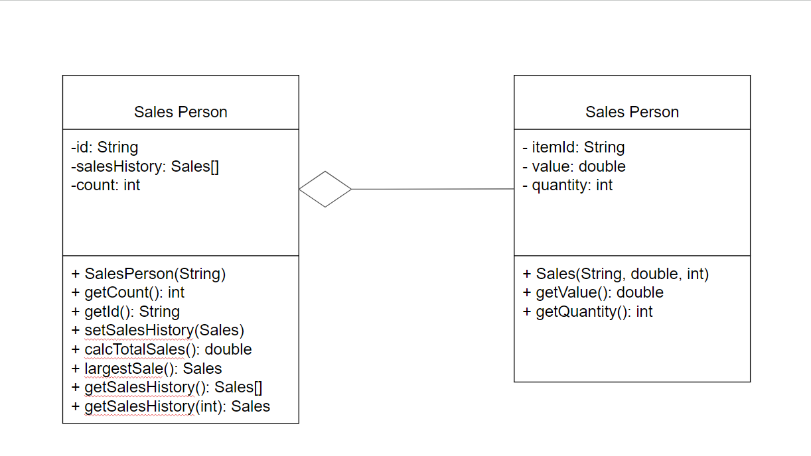

# OOP Forum Week 9 Answers
1a) A class is a template that describes the attributes and behaviors of an object. An instance of a class, is a specific instance of the class that contains its own set of values for the attributes defined in the class.

1b) inheritance Could be used in the Parent GUI CC to extend specific attributes to a UI class. Employees can contain different attributes that are common for all employees, while a subclass of a specific employee can extend upon the main class.

1c) Libraries already have pre built functions. Libraries will allow for more development and much of the time saved can be used to create more options

2b) Because of variables are declared private, access methods are needed to allow access to the variables because their variables can't be accessed outside of this class.

2c)(i) 

2c)(ii)The outline of a negative effect  that a future change in the design of the Sales object might have on this suite of programs is SalesPerson must be changed in Sales. CalcTotalSales is dependent on Sales.

2(d) 
102;
2;
2550.4;
5000;

2h)A suggestion that must be made is a date variable must be added in the class and in the constructor. Getters and Setters for date variables would be needed. CalcTotal would have to account for the date variable.

2i) This is shown by the two constructors in the SalesPerson class; Which is an example of overloading; Constructor is executed by the compiler.
